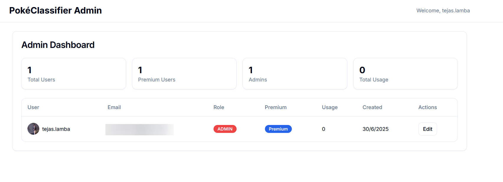

# PokéClassifier 🎮✨

**Live Demo:** [pokeclassifier.tejaslamba.com](https://pokeclassifier.tejaslamba.com)

Transform your photos into personality-matched Pokémon! PokéClassifier uses advanced AI visual analysis to examine your facial expressions, personality traits, and visual style to match you with your perfect Pokémon companion based on sophisticated computer vision and personality assessment.


## What Makes This Special

Ever wondered which Pokémon you'd be based on your actual appearance and personality? This isn't just another personality quiz - it's a sophisticated AI system that analyzes your photos using Google Cloud Vision, examines your facial expressions, style choices, and visual cues to create meaningful personality matches with detailed explanations.

### Key Features

- **Advanced Computer Vision** - Google Cloud Vision API analyzes facial expressions, emotions, and visual elements
- **AI Personality Analysis** - Google Gemini examines micro-expressions and visual traits for deep personality insights
- **930+ Pokémon Database** - Comprehensive matching system with detailed personality profiles for every Pokémon
- **Beautiful Results** - Animated cards with personality breakdowns, confidence scores, and visual similarities
- **Multi-Photo Analysis** - Upload up to 5 photos for more accurate personality assessment
- **Premium Features** - Unlimited analyses and priority processing


https://github.com/user-attachments/assets/36c916cd-ed4a-45a9-ac4c-d3b82737902f


## How It Works

1. **Upload Your Photos** - Drop 1-5 clear photos of yourself showing different expressions
2. **AI Visual Analysis** - Computer vision extracts facial expressions, emotions, colors, and visual elements
3. **Personality Assessment** - Advanced AI analyzes your unique personality traits from visual cues
4. **Pokémon Matching** - Algorithm matches your personality with our extensive Pokémon database
5. **Get Results** - Beautiful cards showing your Pokémon match with detailed reasoning

The magic happens through a combination of Google Cloud Vision for facial analysis, custom personality assessment algorithms, and Google Gemini's advanced reasoning capabilities.

## Tech Stack & Architecture

### Frontend

- **Next.js 14** with App Router for modern React development
- **TypeScript** for type safety and better developer experience
- **Tailwind CSS** for responsive, utility-first styling
- **Framer Motion** for smooth animations and interactions
- **Radix UI** components for accessible, customizable UI elements

### Backend & Database

- **PostgreSQL** database hosted on Railway
- **Prisma ORM** for type-safe database operations
- **NextAuth.js** with Discord OAuth integration
- **Upstash Redis** for rate limiting and caching

### AI & Processing

- **Google Gemini 1.5 Flash** for personality analysis from visual data
- **Google Cloud Vision API** for facial expression and emotion detection
- **OCR.space API** as backup service for any text recognition needs
- **Custom visual analysis algorithms** for personality trait extraction

### Infrastructure

- **Vercel** for deployment and hosting
- **Bun** runtime for faster package management
- **GitHub Actions** for CI/CD pipeline

## Development Highlights

### Advanced Facial Analysis

Built sophisticated visual analysis using Google Cloud Vision:

```typescript
// Example: Facial expression and emotion detection
const faceAnalysis = await vision.faceDetection(imageRequest);
const emotions = faceResult.faceAnnotations.map(face => ({
  joy: face.joyLikelihood,
  sorrow: face.sorrowLikelihood,
  anger: face.angerLikelihood,
  surprise: face.surpriseLikelihood
}));
```

### AI Personality Assessment

Implemented advanced personality analysis from visual cues:

```typescript
interface PersonalityAnalysis {
  visualTraits: {
    facialExpression: string
    eyeExpression: string
    overallVibe: string
    energyLevel: "low" | "medium" | "high"
    approachability: "shy" | "neutral" | "outgoing"
  }
  personalityTraits: string[]
  colorPreferences: string[]
  lifestyle: string
  confidence: number
}
```

### Dynamic Pokémon Matching

930+ Pokémon with sophisticated personality matching algorithm:

```typescript
// Scoring algorithm considers multiple factors
const candidatePokemon = pokemonDatabase.map(pokemon => {
  let score = 0
  // Personality trait overlap
  score += personalityOverlap * 2
  // Energy level matching
  score += energyAlignment * 2
  // Visual similarity factors
  score += colorPreferences + lifestyleMatch
  return { pokemon, score }
}).sort((a, b) => b.score - a.score)
```

### Admin Dashboard

Built a comprehensive admin panel for user management:

- Real-time user analytics
- Role-based access control
- Premium subscription management
- Usage tracking and limits



## Performance & Scalability

- **Optimized Image Processing** - Efficient computer vision analysis with progress tracking
- **Rate Limiting** - Redis-based protection against abuse
- **Database Indexing** - Optimized queries for fast user lookups and Pokémon matching
- **CDN Integration** - Fast asset delivery worldwide for Pokémon images
- **Background Processing** - Non-blocking visual analysis for better UX

## Security Features

- **Authentication** - Secure Discord OAuth integration
- **API Protection** - Rate limiting and request validation
- **Environment Security** - Proper secret management for AI APIs
- **Admin Access Control** - Role-based permissions for user management
- **Data Privacy** - Photos processed in memory, not permanently stored

## Local Development

### Prerequisites

- Node.js 18+ (or Bun runtime)
- PostgreSQL database
- Discord OAuth application
- Google Cloud account (optional, for production OCR)

### Setup

```bash
# Clone the repository
git clone https://github.com/TejasLamba2006/PokeClassfier.git
cd PokeClassfier

# Install dependencies
bun install

# Set up environment variables
cp .env.example .env
# Fill in your API keys and database URL

# Set up database
bun db:generate
bun db:push

# Start development server
bun dev
```

### Environment Variables

```env
DATABASE_URL="postgresql://..."
DISCORD_CLIENT_ID="your-discord-client-id"
DISCORD_CLIENT_SECRET="your-discord-client-secret"
GOOGLE_GENERATIVE_AI_API_KEY="your-gemini-api-key"
NEXTAUTH_SECRET="your-nextauth-secret"
```

## Project Structure

```text
├── app/                    # Next.js app router pages
│   ├── api/               # API routes
│   ├── admin/             # Admin dashboard
│   └── page.tsx          # Main application
├── components/            # React components
│   ├── ui/               # Reusable UI components
│   └── upload-zone.tsx   # File upload interface
├── lib/                  # Utility functions
│   ├── auth.ts          # Authentication config
│   ├── ai.ts            # AI integration
│   ├── pokemon-data.ts  # Pokémon database
│   └── db/              # Database schema
├── scripts/              # Database maintenance
└── public/              # Static assets
```


## Challenges Overcome

### Advanced Computer Vision Integration

Different facial expressions and visual cues require sophisticated analysis:

- Micro-expression detection from subtle facial features
- Multi-photo consistency checking for accurate personality assessment
- Color preference analysis from clothing and background choices
- Energy level detection from facial expressions and body language

### AI Prompt Engineering

Crafted sophisticated prompts for accurate visual personality analysis:

- Context-aware analysis based on facial expressions and visual elements
- Balanced scoring across multiple personality dimensions (energy, approachability, creativity)
- Confidence metrics for match quality and reasoning transparency

### Performance Optimization

- Implemented efficient image processing for Google Cloud Vision API
- Optimized Pokémon matching algorithm with pre-scoring and candidate filtering
- Added intelligent caching strategies for repeated personality trait combinations

## Future Enhancements

- **Group Photo Analysis** - Analyze friend groups and team compatibility
- **Personality Evolution Tracking** - Track changes over time with multiple analyses
- **Custom Pokémon Creation** - AI-generated unique Pokémon based on very specific traits
- **Social Features** - Share results and compare matches with friends
- **Mobile App** - Native iOS/Android applications with camera integration
- **Video Analysis** - Analyze personality from short video clips for even more accuracy

## Deployment

The application is deployed on Vercel with:

- Automatic deployments from the main branch
- Environment variable management
- Custom domain configuration
- Analytics and monitoring


## Contributing

While this is primarily a portfolio project, I'm open to suggestions and improvements. Feel free to:

1. Fork the repository
2. Create a feature branch
3. Submit a pull request with your changes

## About the Developer

This project was built by Tejas Lamba as a demonstration of full-stack development skills, combining modern web technologies with AI integration and user experience design.

**Connect with me:**

- Portfolio: [tejaslamba.com](https://tejaslamba.com)
- LinkedIn: [linkedin.com/in/tejaslamba2006](https://linkedin.com/in/tejaslamba)
- GitHub: [github.com/TejasLamba2006](https://github.com/TejasLamba2006)

## License

This project is licensed under the MIT License - see the [LICENSE](LICENSE) file for details.

---

Built with ❤️ and lots of ☕ by Tejas Lamba
